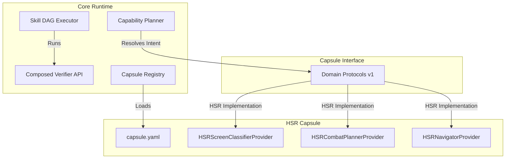

# Honkai: Star Rail (HSR) Capsule Adaptation Plan & Developer Guide

This document describes how to adapt a new game to the **Aurora Decoupled Runtime** using **Honkai: Star Rail (HSR)** as a reference implementation.

---

## 1. Architecture Overview

Aurora has evolved from a game-specific automation system to a **Skill-Centric Verified Agent Runtime**. The boundary is cleanly split:

* **Core Runtime**: StateBus, Orchestration, Skill DAG execution, Composed Verifiers, Record Session, and Capability Planner. It has **zero knowledge** of any specific game.
* **Game Capsules**: Self-contained packages (e.g. under `capsules/genshin`, `capsules/hsr`) containing game-specific screen regions, combat algorithms, navigators, assets, keymaps, and verifiers.

The capsule exposes its domain-specific capabilities by implementing the standardized **Game Domain Protocol v1** interfaces.



---

## 2. Defining a Capsule (`capsule.yaml`)

Every game must declare a `capsule.yaml` manifest. Below is the blueprint of the `hsr` manifest (`capsules/hsr/capsule.yaml`):

```yaml
capsule_id: hsr
version: 1.0.0
display_name: "Honkai: Star Rail"
description: "Turn-based RPG Capsule skeleton providing tactical combat and box-region navigation."

capabilities:
  - hsr_screen_classification
  - hsr_dialog_progression
  - hsr_turn_based_combat
  - hsr_navigation
  - hsr_reward_claim

providers:
  screen_classifier: capsules.hsr.providers:HSRScreenClassifierProvider
  combat_planner: capsules.hsr.providers:HSRCombatPlannerProvider
  navigator: capsules.hsr.providers:HSRNavigatorProvider
  dialog_handler: capsules.hsr.providers:HSRDialogHandlerProvider
  knowledge: capsules.hsr.providers:HSRKnowledgeProvider
  verifier: capsules.hsr.providers:HSRVerifierProvider

keymaps:
  confirm: F
  menu: Esc
  map: M
  normal_attack: Q
  skill: E
  ultimate_1: "1"
  ultimate_2: "2"
  ultimate_3: "3"
  ultimate_4: "4"

resources:
  - resource_id: keymap_config
    kind: file
    path: resources/keymap.yaml
  - resource_id: screen_regions
    kind: file
    path: resources/screen_regions.yaml

skills:
  - skill_id: hsr_combat
    kind: turn_based_skill
    capabilities_provided:
      - hsr_turn_based_combat
    resources:
      - hsr_keymap
    risk_level: medium
    verifiers:
      - combat_finished
  - skill_id: hsr_navigation
    kind: grid_nav_skill
    capabilities_provided:
      - hsr_navigation
    resources:
      - hsr_task_patterns
    verifiers:
      - nav_destination_reached
  - skill_id: hsr_claim_rewards
    kind: menu_interaction_skill
    capabilities_provided:
      - hsr_reward_claim
    risk_level: human_confirm
    resources:
      - hsr_screen_regions
    verifiers:
      - reward_claimed
  - skill_id: hsr_dialog
    kind: dialog_skill
    capabilities_provided:
      - hsr_dialog_progression
    resources:
      - hsr_screen_regions
    verifiers:
      - dialog_progressed
  - skill_id: hsr_screen_classification
    kind: provider_capability
    capabilities_provided:
      - hsr_screen_classification
    resources:
      - hsr_screen_regions
    verifiers:
      - screen_state_classified
```

---

## 3. Implementing the Game Domain Protocol v1

A game capsule must implement the standard protocols defined in [domain_protocols.py](file:///d:/Aurora/vision_agent_kernel_v0_5/capsules/domain_protocols.py).

### 3.1 Screen Classifier Protocol

Detects UI state (e.g. overworld, combat, dialog, rewards) without leaking game concepts to Core.

```python
from capsules.domain_protocols import ScreenClassifierProtocol, ScreenState, ProviderHealth

class HSRScreenClassifierProvider(ScreenClassifierProtocol):
    def classify(self, frame, state_bus) -> ScreenState:
        # Check active screen pixel arrays or OCR tags
        return ScreenState(state="overworld", confidence=0.95)

    def health(self) -> ProviderHealth:
        return ProviderHealth(status="ok")
```

### 3.2 Combat Planner Protocol

Responsible for making combat decisions. For HSR, it implements tactical turn-based action selections.

```python
from capsules.domain_protocols import CombatPlannerProtocol, CombatContext, CombatPlan

class HSRCombatPlannerProvider(CombatPlannerProtocol):
    def plan(self, context: CombatContext) -> CombatPlan:
        # Check character stats, skill points, ultimate gauges
        return CombatPlan(
            action_keys=["skill", "confirm"],
            thought="Ally HP is healthy. Use skill on enemy target."
        )
```

### 3.3 Navigator Provider Protocol

Plans local coordinate navigation. For HSR, this deals with corridors and teleport waypoints.

```python
from capsules.domain_protocols import NavigatorProtocol, NavigationGoal, NavigationPlan

class HSRNavigatorProvider(NavigatorProtocol):
    def plan(self, goal: NavigationGoal, screen_state: ScreenState, knowledge: Any) -> NavigationPlan:
        return NavigationPlan(
            steps=[{"type": "move", "dir": "forward", "duration": 1.5}],
            route_valid=True,
            thought="Navigating toward quest marker."
        )
```

---

## 4. Capability Planner Integration

Core uses the `CapabilityPlanner` to resolve user intent to capability demands, select and rank capsule skills:

1. **Strict-Mode Compliance**: Under strict mode, any high-risk/human-confirm skills (e.g. `hsr_claim_rewards` with `human_confirm` risk) **must** have verifiers declared or the plan is blocked.
2. **Active Capsule Isolation**: The planner will only select skills belonging to the `active_capsule_id` or `core`.

---

## 5. Verification Checklist & Best Practices

When adapting a new capsule:
* **No Core Pollution**: Do not import any `capsules.hsr` module or file inside the `core/` folder. Everything must load dynamically through the `ProviderRegistry`.
* **Zero Gameplay Requirement for Tests**: Unit tests must utilize mock frames/ocr states to prove protocol wiring without requiring the actual game client.
* **Compatibility**: Run the pytest suite (`pytest`) to ensure existing capsules do not regress.
