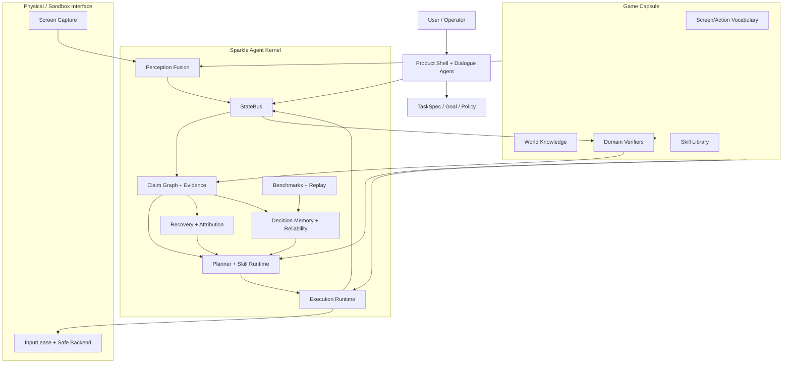

# Sparkle Agent Kernel 长期架构设计（总纲）

版本：v1.1
日期：2026-06-01
状态：**长期总纲文档** — 所有 ADR 和 Spec 文档的权威父文档
适用范围：`vision_agent_kernel_v0_5` 及后续 Sparkle/Aurora Agent Kernel 系列

子文档：
- `AURORA_SPARKLE_AGENTS_CORE_ARCHITECTURE.md` — L0-L9 多层神经运行时 ADR
- `AUTONOMY_RUNTIME_CONTRACT.md` — 字段、状态机、StateBus slot 权威协议
- `CAPSULE_SPEC.md` — YAML + Python plugin 胶囊规范
- `OPERATOR_AGENT_SPEC.md` — 伴侣 Agent、RuntimeOverride、用户确认协议
- `DESKTOP_TREE_SPEC.md` — 模板锚定、ROI OCR、UI tree
- `WORLD_STATE_GRAPH_SPEC.md` — 3D 寻路、landmark、目标跟踪

本文档不是一份“再写一些模块”的计划，而是对当前方向的批判性重构。它回答四个问题：

1. 为什么我们针对原神写了大量代码，却没有自然转化为高度可用的系统。
2. 通用 Agent 框架与游戏特定适配之间应该如何分层。
3. Skill、验证、记忆、VLM/LLM、用户交互在长期架构中到底扮演什么角色。
4. 后续开发怎样避免再次陷入“代码很多，但真实闭环没有兑现”的状态。

安全边界沿用项目根目录 `SAFETY.md`：默认 dry-run；真实物理输入只允许显式授权的 safe-window / QA / 自建测试环境；禁止在线游戏自动化、反作弊绕过、进程注入、驱动级输入和原始模型直发键鼠。

---

## 1. 批判性诊断：当前系统为什么没有自然变成可用系统

### 1.1 组件库完成不等于自主闭环完成

当前项目已经积累了大量能力：UIFlow、SkillRegistry、Boss Handler、MainlineRunner、PerceptionFusionRuntime、BAGEL/ClaimGraph、SafeWindowInputBackend、CheckpointStore、AuroraBench 等。问题不在于“没有模块”，而在于很多模块曾经以库的形态存在，没有被强制收束到唯一生产闭环：

```text
Frame -> Semantic State -> Claim -> Plan -> ActionContract
      -> InputLease -> Post-action Observation -> Claim Adjudication
      -> Recovery / Replan / Checkpoint / Learn
```

只要主路径允许绕过这条链，系统就会出现“测试很多、组件很多、但实际联调仍靠人一步步调”的状态。

### 1.2 原神特化优化有价值，但不能成为框架本体

原神是非常好的压力测试场，因为它包含：

- 开放 3D 场景、复杂 UI、对话、战斗、地图、传送、加载、活动弹窗。
- 大量版本漂移和新机制。
- 非结构化视觉信息、空间导航、剧情分支、临时事件。

但原神绝不能变成内核里的业务假设。内核不能知道“锚点按钮在某坐标”“冒险家协会选第几个选项”“某 Boss 第几秒放技能”。这些只能存在于游戏 Capsule、Skill 经验、可验证流程、或可过期的知识包里。

### 1.3 if-else 无法覆盖长期复杂性

复杂游戏场景不是有限状态表。解谜、活动、剧情、地图、临时弹窗和 UI 改版会持续引入新情况。若每个新情况都补一段规则，系统会变成不可维护的脚本仓库。

正确方向不是完全抛弃规则，而是让规则退回到更合适的位置：

- 高频生存反射可以规则化。
- 安全边界必须规则化。
- 已稳定 UI 流程可以模板化。
- 语义理解、目标分解、异常解释、未知场景处理必须交给可控的推理层。

### 1.4 用户交互现在太像工程调试，不像产品

当前用户要通过 code agent 描述现场、调参数、跑测试、改代码。这不是长期产品形态。长期形态应该是：

```text
用户自然语言 -> 内置对话 Agent -> 解释当前状态
             -> 生成/修改 TaskSpec、Skill 参数、风险策略
             -> dry-run 预演 -> 用户确认 -> 执行 -> 可解释反馈
```

用户不应该直接调一堆底层参数。用户应该和系统内部的 Operator Agent 对话，由它把自然语言映射为框架内部参数、策略和可验证任务。

### 1.5 核心创新不是“能调用模型”，而是信息闭环

项目真正的核心不是 VLM/LLM 本身，而是把环境中的视觉信息抽取为结构化语义，把语义变成可验证行动，把行动结果反馈回状态图和记忆系统。

这更接近“无需预训练 RL 的环境交互 Agent”：

```text
Observe -> Extract -> Reason -> Act -> Verify -> Attribute -> Learn
```

LLM/VLM 只是闭环中的推理器和语义传感器。它们不应该直接承担整个系统的全部复杂度。

---

## 2. 北极星目标

Sparkle Agent Kernel 的目标是构建一个通用视觉交互 Agent 内核。它可以被不同游戏或 3D 应用 Capsule 适配，但内核本身不依赖任何具体游戏。

长期目标：

1. 输入是屏幕、用户目标、历史经验和安全策略。
2. 输出是经过安全租约约束的语义动作，而不是裸键鼠。
3. 每一步都生成可追溯 claim，而不是只返回 success。
4. 每个 claim 都有观察证据、置信度、验证器、恢复策略和可审计记录。
5. Skill 是知识压缩单元，不是固定坐标脚本。
6. 未知场景通过推理、探索、用户协作和经验归纳处理，而不是无限补 if-else。
7. Genshin Capsule 是第一压力测试场；HSR、其他游戏、自建 testbed 是泛化验收场。

---

## 3. 不可妥协的设计原则

### 3.1 Kernel 与 Game Capsule 分离

Kernel 只定义通用协议、状态流、验证闭环、安全执行、记忆和学习。Game Capsule 提供游戏词汇、UI 语义、世界知识、动作约束和领域 verifier。

Kernel 不能 import Genshin 业务模块。Capsule 可以 import Kernel 协议。

### 3.2 Claim 是事实单位

动作是否执行不是最终事实。真正的事实是状态是否按预期变化。

示例：

```text
Bad:
  click("领取奖励") -> success=True

Good:
  ActionReceipt: click submitted
  ObservationClaim: reward dialog disappeared
  ObservationClaim: inventory count increased
  StateDeltaClaim: daily_commission_reward_claimed verified
```

### 3.3 Skill 是知识压缩，不是死脚本

Skill 不是“按 W 3 秒，再点坐标”。Skill 是对复杂行为的可调用抽象：

```text
目标：领取每日委托奖励
前置：在主城或可打开地图
流程：传送到主城附近锚点 -> 找到冒险家协会 NPC -> 交互 -> 选择奖励相关选项 -> 确认
感知：OCR 识别 NPC 名称、选项文本、弹窗标题
容错：活动弹窗、过场、选项顺序变化、加载、误点
验证：奖励弹窗消失、获得物品 toast、任务状态变化
```

Skill 可以包含固定流程，但必须允许感知查询、模型推理、局部重规划、fallback 和版本漂移降级。

### 3.4 LLM/VLM 应降复杂度，不接管所有复杂度

模型适合：

- 把复杂画面解释成语义。
- 对未知 UI 或解谜做假设。
- 根据目标和上下文生成计划。
- 解释失败原因和提出 recovery。
- 把用户自然语言转为 TaskSpec。

模型不适合：

- 毫秒级躲避。
- 连续相机伺服。
- 高频键鼠控制。
- 安全策略裁决。
- 未经验证地声明成功。

### 3.5 多频率脑-身分层

系统必须按控制频率分层：

| 层级 | 类比 | 频率 | 职责 |
|---|---|---:|---|
| Reflex Spine | 脊柱反射 | 30-120Hz | 输入租约、急停、焦点保护、闪避反射、释放按键 |
| Cerebellum | 小脑 | 5-30Hz | 相机伺服、目标跟踪、短程移动、避障、动作平滑 |
| Perception Cortex | 感知皮层 | 1-10Hz | ScreenStateClaim、OCR、UI element、场景摘要 |
| Executive Brain | 执行大脑 | 0.2-2Hz | 任务分解、Skill 选择、重规划、恢复 |
| Reflective Brain | 反思大脑 | 按需 | 失败归因、经验归纳、版本漂移、用户解释 |

### 3.6 用户是 Operator，不是调参脚本作者

长期 UI 必须让用户通过自然语言和可视化状态操作系统。底层参数仍可存在，但默认应该由 Operator Agent 管理、解释和修改。

---

## 4. 总体架构



---

## 5. 核心层定义

### 5.1 Physical Interface

职责：

- 屏幕采集。
- 授权窗口焦点检查。
- InputLease 下发。
- 急停和 release_all。

禁止：

- 业务层直接发裸键鼠。
- 模型直接发裸键鼠。
- 绕过 InputWorker。

### 5.2 Perception Fusion

职责：

- 把帧转为多层状态。
- 高频输出 `Observation`。
- 中频输出 `ScreenStateClaim`、`CombatSignal`、`NavigationSignal`、`FrameQuality`。
- 低频调用 VLM 做不确定场景仲裁。

关键要求：

- Perception 不做任务决策。
- 每个输出都要有时间戳、frame_id、confidence 和 source。
- 原始图像不能无限保留，只保留 bounded reference 或 evidence snapshot。

### 5.3 Scene Graph 与 Affordance

仅有 screen_state 不够。未来应引入通用 `SceneGraph`：

```python
@dataclass(frozen=True, slots=True)
class SceneObject:
    object_id: str
    kind: str                  # npc, enemy, button, waypoint, item, door, puzzle_part
    label: str
    bbox_norm: tuple[float, float, float, float] | None
    spatial_hint: str = ""      # left, near, above, behind, far, unknown
    confidence: float = 0.0
    source: str = "unknown"

@dataclass(frozen=True, slots=True)
class Affordance:
    affordance_id: str
    verb: str                   # talk, attack, open, select, teleport, follow, inspect
    target_object_id: str
    preconditions: tuple[str, ...] = ()
    expected_delta: str = ""
    risk_level: str = "low"
```

Agent 不应直接问“按钮坐标是多少”，而应问“当前有哪些可行动作，它们能推进哪个目标”。

### 5.4 Claim Graph

Claim Graph 是长期可靠性的核心。它承担：

- 状态变更声明。
- 观察证据归档。
- 置信度聚合。
- 失败归因。
- 下游依赖失效。
- 延迟审计。

主路径必须永远遵守：

```text
SemanticAction -> ActionContract -> Receipt
Receipt + ObservationClaims -> StateDeltaClaim
StateDeltaClaim -> Adjudicator -> verified / uncertain / rejected
```

### 5.5 Planner 与 Skill Runtime

Planner 不应该只是选择固定 route。它应处理：

- 目标分解。
- Skill 检索与组合。
- 不确定性退出。
- 局部探索。
- Recovery 选择。
- 用户确认请求。

Skill Runtime 负责把 Skill Recipe 实例化为 ActionContract，并把每步结果送回 Claim Graph。

### 5.6 Execution Runtime

Execution Runtime 是语义动作到物理输入的唯一通道：

```text
SemanticAction
  -> ActionContractValidator
  -> InputLease
  -> InputWorker
  -> PhysicalReceipt
  -> post-action perception
  -> verifier
```

它不应该宣布业务成功，只能宣布“动作被提交、被接受、已执行、已验证或失败”。

### 5.7 Memory 与 Reliability

记忆不只是日志。它应分层：

| 层 | 内容 | 用途 |
|---|---|---|
| RunJournal | 每次运行原始事件 | 调试和回放 |
| EvidenceStore | 截图、OCR、claim evidence | 审计和 verifier 改进 |
| DecisionMemory | 失败原因、成功路径、策略摘要 | Planner 复用 |
| ReliabilityStore | skill/verifier/context 可靠性 | 自动降级和选择 |
| VersionDriftStore | UI/地图/内容漂移 | Skill bootstrap |

---

## 6. Game Capsule 协议

每个游戏必须以 Capsule 形式接入。

```python
class GameCapsule(Protocol):
    game_id: str

    def screen_vocabulary(self) -> ScreenVocabulary: ...
    def action_vocabulary(self) -> ActionVocabulary: ...
    def world_knowledge(self) -> WorldKnowledgeProvider: ...
    def verifier_bundle(self) -> VerifierBundle: ...
    def skill_library(self) -> SkillLibrary: ...
    def risk_policy(self) -> RiskPolicy: ...
```

Capsule 可以包含：

- UI 词汇：对话、地图、菜单、背包、商店。
- 动作词汇：交互、传送、战斗、移动、选择、确认。
- 世界知识：地点、NPC、任务、锚点、常见路径。
- 领域 verifier：奖励领取、战斗结束、传送成功、对话推进。
- Skill 库：游戏特定流程。

Capsule 不允许：

- 绕过 Kernel 输入租约。
- 绕过 ClaimGraph 验证。
- 把固定坐标作为唯一事实来源。
- 把游戏私有状态泄漏进 Kernel 类型系统。

---

## 7. Genshin Capsule 的定位

原神是第一优先级，不是因为要把它写死进 Kernel，而是因为它能暴露 Kernel 的真实能力短板。

### 7.1 原神必须覆盖的代表性闭环

| 场景 | 要验证的通用能力 |
|---|---|
| 主线对话推进 | OCR/VLM UI 理解、对话选项、post-action verify |
| 找 NPC 交互 | 目标识别、短程导航、交互 prompt、失败恢复 |
| 寻路找敌人 | 3D 场景理解、方向跟踪、目标重识别、战斗切换 |
| 传送到目标区域 | 地图 UI、锚点定位、加载状态、到达验证 |
| 战斗 | 高频反射、状态监控、胜利确认、死亡恢复 |
| 解谜 | 未知 affordance 抽取、假设生成、安全探索、用户协作 |
| 活动弹窗/版本变化 | version drift、Skill 降级、用户确认 |

### 7.2 原神中不应长期依赖的内容

- 固定屏幕坐标。
- 对话选项固定序号。
- 菜单固定层级。
- Boss 纯时间轴脚本。
- “看到某颜色就一定代表某机制”的单一规则。

这些可以作为 bootstrap hints，但不能作为最终成功依据。

---

## 8. Skill 作为知识压缩单元

### 8.1 Skill Recipe Schema

```python
@dataclass(frozen=True, slots=True)
class SkillRecipe:
    skill_id: str
    title: str
    goal_template: str
    applicable_context: tuple[str, ...]
    preconditions: tuple[str, ...]
    steps: tuple[SkillStep, ...]
    verifiers: tuple[str, ...]
    recovery_policies: tuple[str, ...]
    risk_level: str
    version: str

@dataclass(frozen=True, slots=True)
class SkillStep:
    step_id: str
    intent: str
    target_query: str
    expected_delta: str
    locator_policy: str = "affordance_then_vlm"
    retry_policy: str = "resample_relocate_replan"
```

### 8.2 Skill 生命周期

```text
Recorded Trace
  -> Segmented Procedure
  -> Generalized Skill Recipe
  -> Sandbox Verified
  -> Claim Verified in QA
  -> Reliability Promoted
  -> Drift Detected
  -> Bootstrap / Repair / Retire
```

### 8.3 Skill 执行不应是线性脚本

每个 Skill Step 都必须允许：

- 重新观察。
- 重新定位目标。
- 跳过已完成步骤。
- 处理弹窗和加载。
- 改用备用 affordance。
- 请求模型解释。
- 请求用户确认。
- 失败后输出可复盘 claim。

---

## 9. LLM/VLM 使用策略

### 9.1 调用模型的时机

应该调用模型：

- screen_claim 低置信。
- OCR 与 classifier 冲突。
- 未知 UI/未知解谜。
- Planner 无可用 skill。
- Recovery 多次失败。
- 用户要求解释或修改策略。

不应该调用模型：

- 每一帧都问下一步。
- 高频战斗反射。
- 已稳定的按钮定位。
- 安全策略判断。
- 可由本地 verifier 便宜确认的事实。

### 9.2 云端与本地模型

本地模型 GPU 占用高、延迟不稳定时，不应把它作为强依赖。推荐策略：

```text
本地轻量检测器：高频、便宜、保底
云端 VLM/LLM：低频、复杂语义、疑难仲裁
缓存/记忆：相同 UI 和相同任务优先复用
用户协作：高风险或长期不确定时介入
```

### 9.3 模型输出必须结构化

模型不得直接输出“按 E、点这里”。模型输出必须落到：

- Scene description。
- Affordance list。
- Plan proposal。
- Recovery hypothesis。
- User-facing explanation。

所有物理动作仍由 Execution Runtime 生成 ActionContract。

---

## 10. 用户交互架构

### 10.1 Operator Agent

产品内应有一个常驻 Operator Agent。它负责：

- 理解用户自然语言目标。
- 显示当前感知状态和不确定性。
- 修改 TaskSpec、Skill 参数、风险策略。
- 发起 dry-run。
- 请求用户确认。
- 解释失败和恢复选择。

用户说：

```text
先帮我跑主线，如果遇到选项就选最像推进任务的；不要消耗稀有资源；卡住超过 2 分钟叫我。
```

Operator Agent 应转成：

```text
TaskSpec:
  objective: mainline_progress
  dialog_policy: progress_main_story
  resource_policy: no_rare_consumables
  uncertainty_policy: ask_user_after_120s
  execution_mode: dry_run_or_authorized_safe_window
```

### 10.2 必备 UI 面板

| 面板 | 用途 |
|---|---|
| Mission Control | 当前目标、阶段、下一步、风险 |
| Perception View | 当前 screen_claim、场景描述、UI elements |
| Claim Timeline | 每一步 claim、证据、验证结果 |
| Skill Editor | Skill Recipe 可视化编辑和版本管理 |
| Replay/Audit | 运行回放、失败归因、截图证据 |
| Capsule Manager | 切换 Genshin/HSR/Testbed Capsule |
| Model Budget | 模型调用、延迟、成本、缓存命中 |
| Safety Console | 急停、授权窗口、输入租约、焦点状态 |

### 10.3 调参方式

默认调参入口不应该是 config 文件，而应该是对话：

```text
用户：它总是在地图界面误判成菜单。
系统：我看到最近 8 次 map/menu 冲突发生在加载后 1 秒内。是否把加载后 map 判定稳定窗口从 300ms 提到 800ms？
```

Operator Agent 生成可审计配置变更，并记录原因。

---

## 11. 未知场景与解谜处理

未知场景不能靠提前写规则解决。应采用安全探索闭环：

```text
1. Observe: 生成 SceneGraph 和可交互元素。
2. Hypothesize: 模型提出 1-3 个可验证假设。
3. Probe: 选择低风险动作试探。
4. Verify: 观察状态变化。
5. Attribute: 归因动作是否有效。
6. Learn: 写入临时 skill patch 或 decision memory。
7. Escalate: 不确定或高风险时请求用户。
```

解谜不是“让模型直接解决所有东西”，而是让模型在框架限制下生成可验证试探。

---

## 12. 评测与验收体系

任何新能力必须有四级验收：

1. Unit：协议、状态机、verifier、schema。
2. Simulated E2E：伪帧、伪 UI、伪输入。
3. Recorded Replay：真实录屏/截图回放，不发输入。
4. Authorized Safe-window QA：显式授权窗口，输入租约，完整审计。

通过标准不是“动作跑了”，而是：

```text
目标 claim verified
证据可追溯
失败可恢复
checkpoint 可恢复
用户能理解当前状态
跨 Capsule 类型不泄漏
```

长期基准套件：

- Mainline story micro-loop。
- Dialog branch loop。
- Navigation to target loop。
- Combat survival loop。
- Unknown popup loop。
- Puzzle safe-probe loop。
- Version drift loop。
- Multi-game capsule smoke test。

---

## 13. 与现有代码的关系

### 13.1 继续保留并提升为 Kernel 资产

| 现有组件 | 长期角色 |
|---|---|
| `StateBus` | Kernel 状态总线 |
| `InputLease` / `InputWorker` | 物理输入唯一通道 |
| `PerceptionPipeline` / `PerceptionFusionRuntime` | 感知融合层 |
| `ScreenStateClaim` | 中频语义状态 |
| `MissionGraphV4` | 计划 DAG 内部表示 |
| `ClaimGraphWorker` / `ClaimAdjudicator` | 事实验证核心 |
| `ExecutionRuntime` | ActionContract 执行层 |
| `CheckpointStore` | 会话恢复基础 |
| `AuroraBench` | dry-run 回归基准 |

### 13.2 降级为 Capsule 或 Legacy Skill

| 现有组件 | 处理方式 |
|---|---|
| Genshin-specific UIFlow | 转为 Genshin Capsule 的 Skill Recipe 或 bootstrap hint |
| Boss Handler 时间轴 | 转为 Combat Playbook + verifier + reflex policy |
| 固定坐标点击 | 仅作为低置信 fallback，不作为成功事实 |
| 手写 quest 路由 | 转为世界知识和 Skill 检索索引 |

### 13.3 必须停止扩张的模式

- 为每个新 UI 补一段 if-else。
- 让测试 mock 成功掩盖生产缺口。
- 将 VLM 当成万能函数，绕过 ClaimGraph。
- 用坐标表替代元素定位。
- 用“任务完成了”替代可验证状态变化。
- 让用户靠 code agent 间接调参。

---

## 14. 开发路线图

### M0：文档和边界冻结

- 修复所有核心架构文档编码和术语。
- 明确 Kernel/Capsule/Product Shell 边界。
- 所有新增模块必须标注归属层。

验收：

- `check_core_boundaries.py` 通过。
- 文档中每个核心类型都能映射到代码或明确为 future contract。

### M1：Kernel Contract Package

新增 `agent_kernel/` 或等价包，集中定义：

- `GameCapsule`
- `SceneGraph`
- `Affordance`
- `SkillRecipe`
- `TaskSpec`
- `ActionContract`
- `ClaimEvidence`
- `OperatorCommand`

验收：

- 不依赖 Genshin。
- 可以用 fake capsule 跑通 observe-plan-act-verify。

### M2：最小真实闭环

选择一个小场景，不追求宏大：

```text
打开一个 UI -> 识别目标按钮 -> 点击 -> 验证弹窗变化 -> checkpoint -> replay
```

验收：

- 不允许直接写坐标。
- 不允许跳过 post-action verify。
- Claim timeline 可视化可读。

### M3：Operator Agent 与产品壳

实现自然语言任务入口：

- 用户目标 -> TaskSpec。
- 当前状态解释。
- 策略变更建议。
- dry-run 预演。
- 风险确认。

验收：

- 用户无需改代码即可调整任务策略。
- 每次策略变更写入审计日志。

### M4：Genshin Capsule 深化

以原神作为压力测试：

- 主线微闭环。
- 对话选择。
- 找 NPC。
- 传送。
- 找敌人并切入战斗。
- 弹窗/加载/失败恢复。

验收：

- 每个场景都有 replay 数据。
- 每个成功都由 claim 证明。
- 每个失败都能归因或请求用户。

### M5：HSR / 其他游戏 Capsule

不是追求功能多，而是验证 Kernel 没有 Genshin 泄漏。

验收：

- HSR Capsule 不需要改 Kernel。
- 只替换 vocab、world knowledge、verifier、skill library。

### M6：Skill 归纳与版本漂移

将录制轨迹和成功运行自动归纳为 Skill Recipe。

验收：

- Skill 可从 trace 生成。
- Skill 可被 verifier 晋级。
- UI 改版后自动降级为 bootstrap。

### M7：长期基准和数据闭环

建立持续回归：

- dry-run。
- replay。
- safe-window QA。
- model-cost regression。
- version drift regression。

验收：

- 每次提交都能回答“哪个闭环更可靠了，哪个变差了”。

---

## 15. 判断架构是否走偏的信号

出现以下信号，说明方向走偏：

- 新增能力需要先让 code agent 改代码才能被用户使用。
- 新增一个游戏必须复制一套 Runner。
- Skill 只能在同分辨率同 UI 状态下工作。
- 成功结果没有证据截图、OCR、claim 或 verifier。
- VLM 调用越来越多，但系统可靠性没有上升。
- 用户不知道系统现在在看什么、为什么失败、下一步要做什么。
- 测试通过但 replay 不可解释。

---

## 16. 近期最重要的工程决策

1. 不再把“更多 Genshin 特化代码”视为默认进展；只有能沉淀为 Capsule、Skill Recipe、Verifier 或 Kernel contract 的代码才算长期资产。
2. 先做小而硬的闭环，不做大而虚的主线全自动口号。
3. 把用户交互层提升为一等模块；没有 Operator Agent，系统就仍是工程工具，不是产品。
4. 所有 success 必须经过 claim；所有 failure 必须进入 attribution；所有 uncertainty 必须有退出策略。
5. VLM/LLM 调用必须被预算、缓存、结构化输出和 verifier 约束。
6. Genshin 是第一压力测试场，但 Kernel 的验收必须包含至少一个非 Genshin Capsule。

---

## 17. 一句话总结

Sparkle Agent Kernel 的本质不是“写一个会玩某个游戏的脚本”，也不是“让大模型直接控制屏幕”。它是一套把视觉世界抽取为语义、把语义转成可验证动作、把动作结果沉淀为可复用知识的通用 Agent 操作系统。

原神的价值在于逼出这套操作系统的真实复杂度；真正的胜利不是覆盖所有原神场景，而是当新场景出现时，系统能够看懂、试探、验证、学习、解释，并在安全边界内继续推进。
